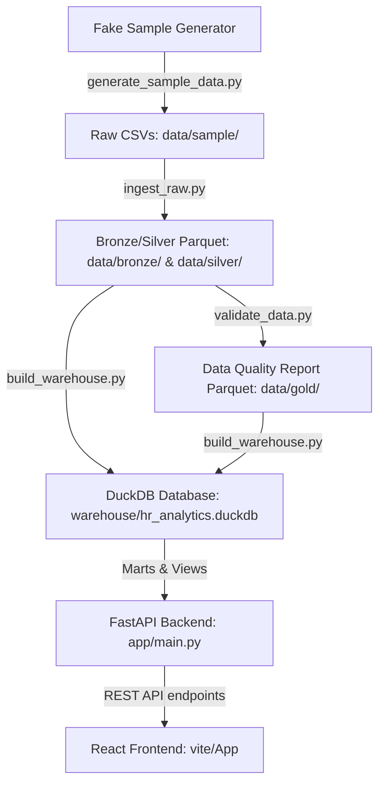

# Architecture Documentation

## Overview

The HR Analytics Command Center is designed as a **local-first** application. All data remains stored locally, calculations are performed locally via DuckDB, and it does not rely on third-party cloud data warehouses or BI software.

## Data Flow Diagram

## Component Responsibilities

1. **Scripts (`scripts/`)**:
   - `generate_sample_data.py`: Creates realistic mock data with intentional errors.
   - `ingest_raw.py`: Fast tabular read/cast using Polars, writing Parquet file outputs.
   - `validate_data.py`: Computes schema validations and business rules, generating raw issue lists.
   - `build_warehouse.py`: Sets up DuckDB tables, joins facts and dimensions, and exposes consolidated mart views.
   - `refresh_all.py`: Orchestrator script to run all the scripts sequentially.

2. **Backend (`backend/`)**:
   - FastAPI serves standard endpoints by querying the DuckDB database file.
   - Pydantic validates API responses.
   - Service layer manages SQL execution and database connection lifecycle.

3. **Frontend (`frontend/`)**:
   - Single Page Application built with React, TypeScript, and Vite.
   - Styled with Tailwind CSS (Vanilla setup without full shadcn/ui).
   - Renders data using Apache ECharts (`echarts-for-react`) and standard pagination tables (`@tanstack/react-table`).
   - Strict rule: No analytical formulas inside frontend code.

## Future Upgrade Path
- **dbt Integration**: In Milestone 2+, migrations of SQL views to dbt models for testing and document generation.
- **Airflow/Prefect Orchestration**: Replacing the local Python script orchestrator with a professional scheduler when moving to cloud staging.
- **Identity Middleware**: Integrating JWT OAuth2 for page access controls.
