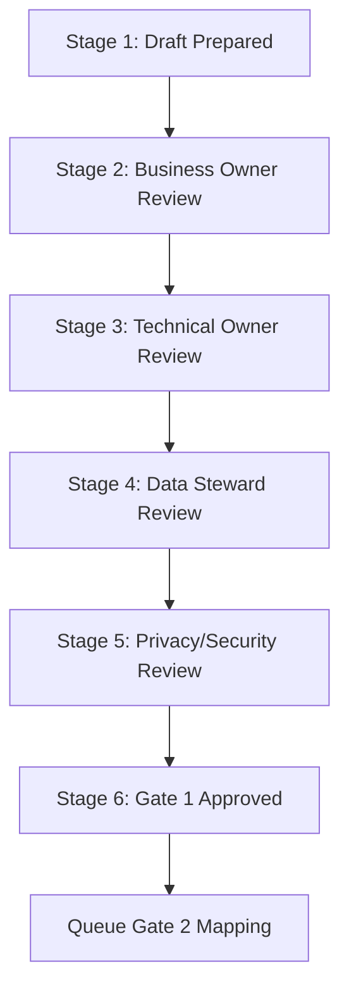

# Gate 1 Approval Workflow

This document outlines the structured process for reviewing and approving each source system registry before transitioning the system to Gate 1 readiness.

---

## 1. Workflow Stages

### Stage 1: Draft Prepared
*   **Actor**: HR Analytics Lead
*   **Required Evidence**: Draft row in `source_owner_matrix.yml` and `source_mapping_validation.yml`.
*   **Allowed Decision Values**: `Draft`
*   **Comments Required if Rejected**: N/A

### Stage 2: Business Owner Review
*   **Actor**: Business Owner (e.g. HR Director for Employee Master)
*   **Required Evidence**: Field mappings checked against real-world operations.
*   **Allowed Decision Values**: `Approved`, `Needs Clarification`, `Rejected`
*   **Comments Required if Rejected**: Explain missing or incorrect business fields.

### Stage 3: Technical Owner Review
*   **Actor**: Technical Owner (e.g. IT Lead, ERP Systems Admin)
*   **Required Evidence**: Scheduled task export path, file formats, and transfer protocols verified.
*   **Allowed Decision Values**: `Approved`, `Approved with Conditions`, `Rejected`
*   **Comments Required if Rejected**: Outline delivery method, system load, or format issues.

### Stage 4: Data Steward Review
*   **Actor**: Data Steward (e.g. Compliance Manager, HR Admin)
*   **Required Evidence**: Schema data types, data quality validation checks verified.
*   **Allowed Decision Values**: `Approved`, `Needs Clarification`
*   **Comments Required if Rejected**: Describe missing transformation rules or type mismatches.

### Stage 5: Privacy/Security Review
*   **Actor**: Information Security Lead / Legal
*   **Required Evidence**: Masking rules and privacy classifications validated.
*   **Allowed Decision Values**: `Approved`, `Blocked`
*   **Comments Required if Rejected**: Detail KSA Personal Data Protection Law (PDPL) compliance gaps.

### Stage 6: Gate 1 Approved
*   **Actor**: Project Sponsor / VP of HR
*   **Required Evidence**: All checklists completed, scoring model $\ge$ 90%, zero critical blockers.
*   **Allowed Decision Values**: `Fully Approved`, `Blocked`
*   **Comments Required if Rejected**: List outstanding blocking items.

---

## 2. Ingestion Rules on Rejection

If any stage results in `Rejected`, the workflow status reverts to `Draft`, and the owner must re-submit after correcting the schema details.
