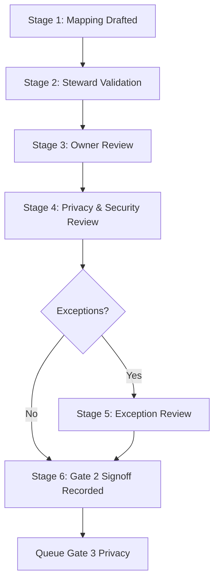

# Gate 2 Mapping Approval Workflow

This document outlines the workflow and sign-block steps for approving source-to-canonical field mappings.

---

## 1. Workflow Stages

### Stage 1: Mapping Drafted
*   **Actor**: HR Analytics Lead
*   **Evidence**: Fields added to `real_data_mapping.yml` and `source_mapping_validation.yml`.

### Stage 2: Steward Validation
*   **Actor**: Data Steward
*   **Evidence**: Validates data types, transformation formulas, and schema rules.

### Stage 3: Owner Review
*   **Actor**: Business Owner
*   **Evidence**: Confirms mappings accurately represent operational flows.

### Stage 4: Privacy & Security Review
*   **Actor**: Information Security Lead
*   **Evidence**: Ensures sensitive fields have assigned masking rules.

### Stage 5: Exception Review (If Applicable)
*   **Actor**: Data Stewardship Board
*   **Evidence**: Approves/rejects exceptions mapped in the Exception Register.

### Stage 6: Gate 2 Signoff Recorded
*   **Actor**: Program Sponsor
*   **Evidence**: Update status in `gate_2_signoff_status.yml` to Fully Approved.

---

## 2. Decision Logic and Actions
*   **Approved**: Progresses the category to the next workflow stage.
*   **Rejected**: Reverts the status to Draft and routes back to the mapping designer.
