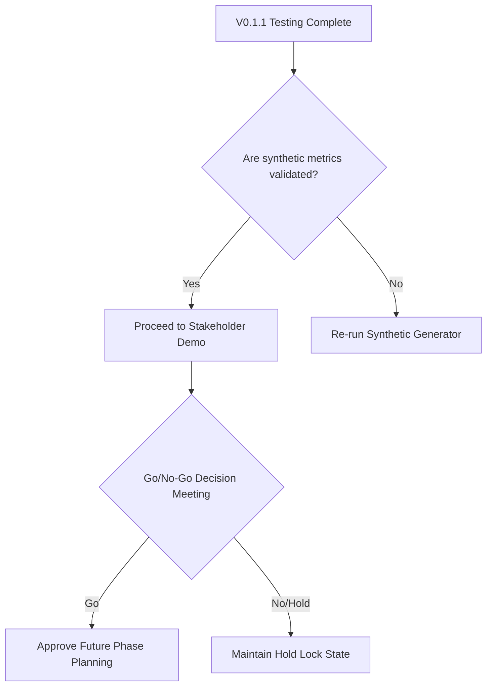

# Governance Handover Package

This package prepares the HR Analytics Command Center for administrative transitions and QA verification.

## 1. Developer Handover Checklist
- [ ] Verify that all pipeline code is isolated to `src/pipelines/synthetic_pipeline.py`.
- [ ] Confirm no connection strings or production variables exist in `config/local_config.yaml` or `.env`.
- [ ] Ensure that no real data paths (`data/real_*`) contain anything other than placeholder `.gitkeep` files.
- [ ] Ensure all tests can be run completely offline with no outbound traffic.

## 2. Administrator Checklist
- [ ] Verify that the governance locks default configuration is loaded as `HOLD` in the database setup.
- [ ] Confirm that modifying lock statuses in the UI only affects local session state and does not trigger real database writes.
- [ ] Inspect the application startup logs to verify the message: `SYSTEM GOVERNANCE ACTIVATED: RUNNING IN SECURE SYNTHETIC SANDBOX`.

## 3. QA Evidence Index
- **Test Suite Execution**: Automated test runs (`pytest`) confirm 100% test pass rate for synthetic pipelines.
- **Network Traffic Audit**: Captured logs indicate zero outgoing connections during simulation runs.
- **Schema Validation**: Verified that `hr_analytics_sandbox.db` follows the schema specifications without using production tables.

## 4. Known Limitations & Sandbox Boundary
- **Network Isolation**: The current build is designed to run isolated locally. If external connections are attempted, the mock HTTP client will fail-safe and abort the operation.
- **Local SQLite/DuckDB Only**: Multi-user authentication and persistent state management are not active in this release.

## 5. Next-Step Decision Trees

