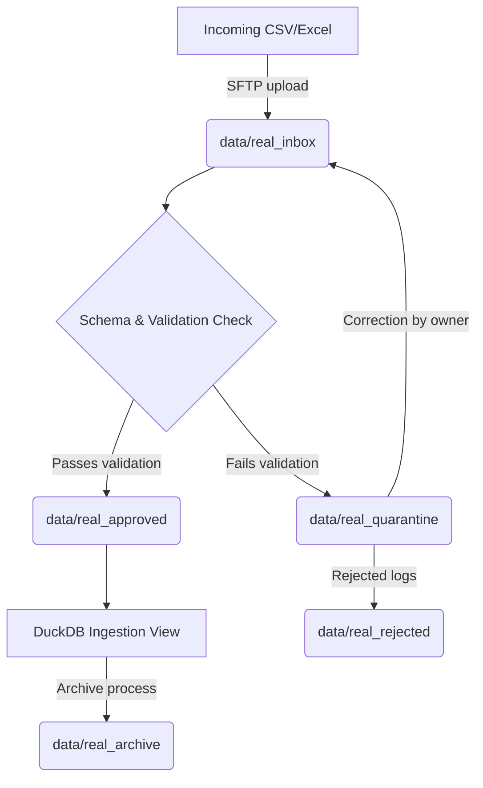

# HR Command Center — Real Data Intake Ingestion Plan

## 1. Scope & Objectives
This plan outlines the controlled processes, timelines, security measures, and validation steps required to safely transition the HR Command Center from synthetic datasets to live source system records. 

No real data will be ingested during this readiness phase. The intake plan is a technical contract designed to prevent data leaks, unauthorized access, or database pollution.

---

## 2. Ingestion Stages & Folder Lifecycle
The ingestion engine operates on a secure directory pipeline structure. Files move sequentially through folders depending on their validation status.

1. **`data/real_inbox/`**: SFTP folder where source systems upload csv/xlsx exports.
2. **`data/real_quarantine/`**: Temporary quarantine staging. Records failing business validation are held here alongside log reports.
3. **`data/real_approved/`**: Storage for validated clean records approved for warehouse compile.
4. **`data/real_rejected/`**: Records rejected by security or owner gates with permanent failure status.
5. **`data/real_archive/`**: Read-only compressed storage of processed files for historical audit trails.

---

## 3. General Security Requirements
- **Data Encryption**: All files at rest in `data/real_*` directories must be encrypted using AES-256. 
- **Transport Security**: SFTP connections must run over SSH (port 22) with certificate-based authorization.
- **Audit Trails**: Every file transfer, validation trigger, and manual approval gate signoff must be logged to a write-once database table (`base_command_center_audit_logs`).
- **Data Retention**: Intake files will be retained in `data/real_archive/` for 90 days, after which they will be deleted. Only database views retain structured historical timelines.
