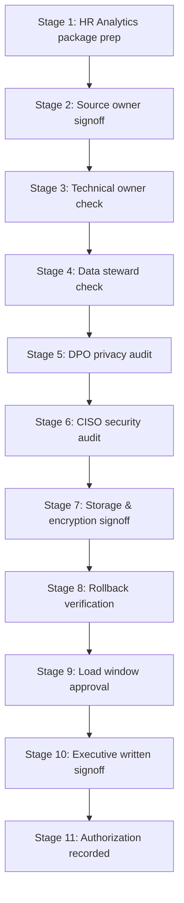

# Real Data Load Authorization Workflow

This document details the 11 stages of review required to authorize and execute a live data load.

---

## 1. Approval Stages Workflow

### Stage 1: Ingestion Package Prep
*   **Role**: HR Analytics Lead
*   **Evidence**: Scope specification files.

### Stage 2: Source Owner Signoff
*   **Role**: Source System Business Owner
*   **Evidence**: Delivery timelines confirmation.

### Stage 3: Technical Owner Check
*   **Role**: IT Operations Director
*   **Evidence**: SFTP connectivity validation.

### Stage 4: Data Steward Check
*   **Role**: Data Quality Steward
*   **Evidence**: Verified column schemas and mappings.

### Stage 5: DPO Privacy Audit
*   **Role**: Data Privacy Officer (DPO)
*   **Evidence**: Masking specifications and opaque token validations.

### Stage 6: CISO Security Audit
*   **Role**: Chief Information Security Officer (CISO)
*   **Evidence**: RBAC role verification.

### Stage 7: Storage & Encryption Signoff
*   **Role**: Infrastructure Director
*   **Evidence**: Folder permissions and encryption flags.

### Stage 8: Rollback Verification
*   **Role**: Systems Engineer
*   **Evidence**: Tested DuckDB snapshot rollback steps.

### Stage 9: Load Window Approval
*   **Role**: Release Manager
*   **Evidence**: Off-peak scheduling.

### Stage 10: Executive written signoff
*   **Role**: Chief HR Officer (CHRO)
*   **Evidence**: Written final load directive.

### Stage 11: Authorization Recorded
*   **Role**: System Architect
*   **Evidence**: Status flag set to Ready in configs.

---

## 2. Decision Log Verification
Before scheduling or execution, the workflow state must be verified and logged in [CONTROLLED_LOAD_DECISION_LOG.md](file:///c:/tmp/HR-DASHBOARD/docs/CONTROLLED_LOAD_DECISION_LOG.md) to confirm that no blockers exist.
