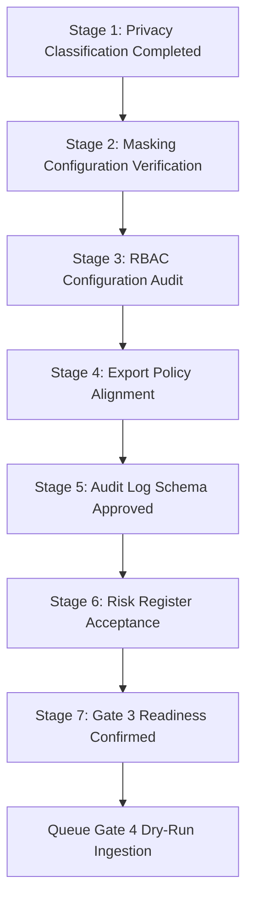

# Gate 3 Security Approval Workflow

This document outlines the validation workflow required to obtain Gate 3 (Privacy, Security & Access-Control Approved) sign-off.

---

## 1. Approval Workflow Stages

### Stage 1: Privacy Classification Completed
*   **Actor**: Data Steward
*   **Verification**: Check that all canonical columns in `privacy_classification.yml` have classifications.

### Stage 2: Masking Configuration Verification
*   **Actor**: Data Privacy Officer
*   **Verification**: Validate that masking rules exist in `masking_rules.yml` for all sensitive columns.

### Stage 3: RBAC Configuration Audit
*   **Actor**: Security Architect
*   **Verification**: Audit allowed modules and row-level views in `access_roles.yml`.

### Stage 4: Export Policy Alignment
*   **Actor**: Compliance Manager
*   **Verification**: Confirm that export capabilities match the export control rules.

### Stage 5: Audit Log Schema Approved
*   **Actor**: Security Lead
*   **Verification**: Confirm that all 13 logging fields are documented.

### Stage 6: Risk Register Acceptance
*   **Actor**: Chief Information Security Officer (CISO)
*   **Verification**: Approve or formally accept mitigations for registered security risks.

### Stage 7: Gate 3 Readiness Confirmed
*   **Actor**: Program Sponsor
*   **Verification**: Set signoff status in `gate_3_signoff_status.yml` to Ready.

---

## 2. Gate 4 Dependency Rule
> [!IMPORTANT]
> Gate 4 dry-run execution cannot be scheduled or executed until Gate 3 Privacy, Security & Access-Control Approval has achieved **Ready** status.
