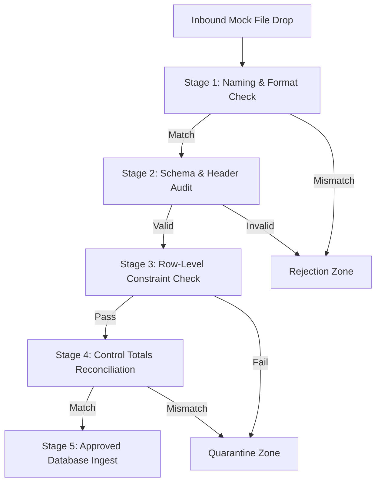

# Synthetic Dry-Run Validation Protocol

This protocol defines the ingestion loop validation checks and execution stages for valid and invalid mock files.

---

## 1. Validation Execution Workflow

---

## 2. Testing Scenarios

### 2.1 Valid Scenarios Testing
*   Ensure that file ingest processes a valid CSV/XLSX template.
*   Reconcile control totals and confirm records match base DuckDB view mappings.

### 2.2 Invalid Scenarios Testing
*   **Duplicate ID / Null ID**: Triggers rule `INT-001` or `INT-002`, routing records to `quarantine/`.
*   **Net Pay / Gross Mismatch**: Triggers rule `LOG-002` or `LOG-003`, rejecting the entire file.
*   **Raw Successor ID Exposed**: Triggers rule `SAF-001`, rejecting the file immediately.
*   **Real Data Indicator**: Triggers rule `SAF-002` or `SAF-003`, blocking ingestion.
